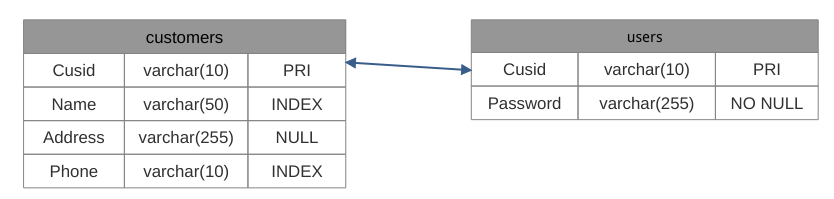
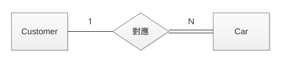
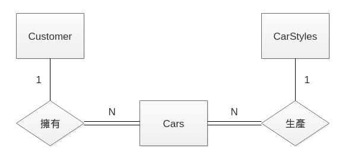
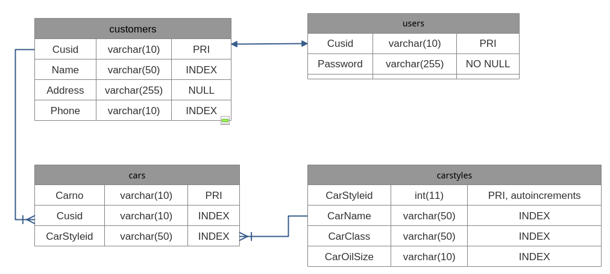
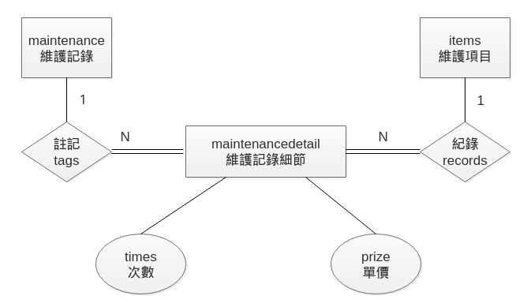
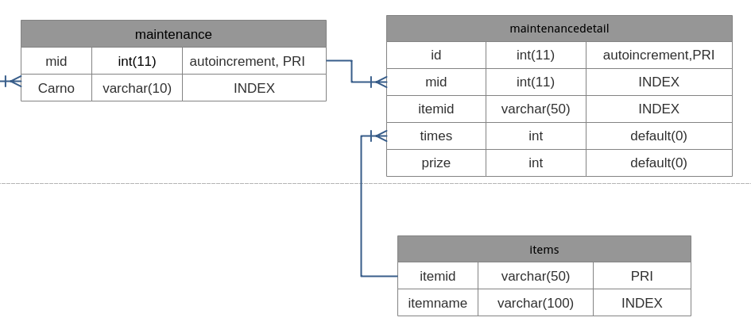

### 第十三章 Laravel 與資料庫的結合 II
#### Eloquent 管理資料庫內容
+ 新增資料
  + 例 :
    ```php
    $post = new App\Customer;
    $post->Name = 'Peter';
    $post->save();
    ```

+ 更新資料
  + 例 :
    ```php
    $post = App\Customer::find(1);
    $post->Name = 'James';
    $post->Phone = '0912345678'
    $post->save();
    ```

+ 大量新增
  + 例 :
    ```php
    // 從 View 送過來的　$request 內容會是陣列，看起來如下：
    $post = App\Customer::create([
        'Name' => 'Merry',
        'Address' => 'Test Load No.12',
        'Phone' => '0912345678'
    ]);
    // 可用下列方法，節省輸入的時間
    $post = App\Customer::create($request->all());
    ```

+ 大量更新
  + 例 :
    ```php
    // 老把戲了
    $post = App\Customer::find(1);
    $post->update([
        'Phone' = '0812345679'
    ]);
    // 記得善用 $request
    $post = App\Customer::get()->update($request->all());
    ```

+ 保護欄位
  + 有些欄位不適合直接使用大量新增或更新的方式
  + 例 : 要保護的欄位是 is_admin
    ```php
    $protected $fillable = [
        'Name','Address'
    ];
    // 或是下面寫法
    $protected $guarded = [
        'is_admin';
    ];
    //被保護之後的欄位，要給值時，只能使用下列方式
    $user = App\Customer::create($request->all());
    $user->is_admin = 1;
    $user->save();
    ```

+ 刪除資料
  + 例 :
    ```php
    $post = App\Customer::find(1)
    $post->delete();
    //也有下列寫法
    $post = App\Customer::destroy(1);
    $post = App\Customer::destroy([1,2,3]);
    $post = App\Customer::destroy(1,2,3);
    ```

+ 大量刪除資料
  + 例 :
    ```php
    $post = App\Customer::where('Name','like','王%')->delete();
    ```  

+ 軟刪除
  + 不會真的刪除資料
  + 配合 migration ，加上 deleted_at 欄位
    + 例 :
      ```php
      Schema::table('customers',function(Blueprint $table){
          $table->softDeletels();
      });
      ```
  + 在模組中，加入 SoftDeletes 這個 Trait
    + 例 : app/Customers.php
      ```php
      <?php
      namespace App;
      use Illuminate\Database\Eloquent\Model;
      use Illuminate\Database\Eloquent\SoftDeletes;
      class Customer extends Model{
          use SoftDeletes;
          //中間有一堆東西，就直接略過了
          protected $date = ['deleted_at'];
      }
      ```
  + 進行軟刪除的動作
    + 例 :
      ```php
      $post = App\Customer::withTrashed()->get();
      //或是使用下列方式
      $post = App\Customer::withTrashed()->find(1);
      //trashed() 用來查看該筆資料是否有被軟刪除
      if($post->trashed()){
          //做些事情
      }
      //下列方法可以取出被軟刪除的資料
      $post = App\Customer::onlyTrashed()->get();
      ```
  + 恢復被軟刪除的項目
    + 例 :
      ```php
      $post = App\Customer::find(1);
      $post->restore();
      //或是一次恢復多筆資料
      $post = App\Customer::onlyTrashed()->restore();
      ```
  + 如果想要強制刪除資料
    + 例 :
      ```php
      $post = App\Customer::find(1);
      $post->forceDelete();
      //或是一次刪除多筆資料
      $post = App\Customer::onlyTrashed()->forceDelete();
      ```

#### Eloquent 關聯與限制
+ 關聯的使用
  + 由一份表格中，引用另一份表格中相關的資料！
  + 常見的用詞 : Primary Key、Foreign Key、Reference Key
+ 關聯的類型與使用方式
  + 一對一 :
  
    + 例 : Users 對應 Customers 
      
      ```php
      public function customer(){
          //每一個使用者帳號對應到一個客戶
          return $this->hasOne(CustomerEloquent::class);
          //如果需要指定 Primary Key，則如下指定
          //return $this->hasOne(CustomerEloquent::class, 'Cusid');
          //若是使用非主鍵，則需要指定外來鍵或參考鍵
          //return $this->hasOne('被關聯模型類別','外來鍵名稱','參考鍵名稱');
      }
      ```
        ------
        ```php
        //利用下列程式碼呼叫對應的客戶資料
        $customer = App\User::find(1)->customer;
        //取得客戶電話
        $customer = App\User::find(1)->customer->Phone;
        ```
        ------
      + 可以反過來查詢
        ```php
        public function user(){
            return $this->belongsTo(UserEloquent::class);
            //表示外來鍵就在 customers 表格上
            //參考鍵則是在 users 表格上
            //return $this->belongsTo('關聯模型類別','外來鍵名稱');
            //return $this->belongsTo('關聯模型類別','外來鍵名稱','參考鍵名稱');
        }
        ```

  + 一對多 :
    
    + 例 : 在 Elopuent 中定義
      ```php
      class Customer extends Model {
          public function cars(){
              return $this->hasMany(CarEloquent::Class,'Cusid');
              //return $this->hasMany('被關聯模型類別','外來鍵名稱');
              //return $this->hasMany('被關聯模型類別','外來鍵名稱','參考鍵名稱');
          }
      }
      ```
      -----
      ```php
      //取得客戶的車牌資料
      $cars = App\Customer::find(1)->cars;
      foreach ($cars as $car){
          $car->carno;
      }
      //若只有取第一筆資料，也可以直接寫
      $carno = App\Customer::find(1)->cars()->first()->carno;
      ```
    
    + 反向關係寫法
      ```php
      class Car extends Model {
          public function customer(){
              //取得該輛車的車主ＩＤ
              return $this->belongsTo(CustomerEloquent::class,'Cusid');
              //其他的寫法
              //return $this->belongsTo(關聯模型類別','外來鍵名稱');
              //return $this->belongsTo(關聯模型類別','外來鍵名稱','參考鍵名稱');
          }
      }
      ```
      -----
      ```php
      $car = App\Car::find(1);
      echo $car->customer->Name;
      //其它的寫法
      //$car = App\Customer::find(1)->cars->first()->carno;
      //$car = App\Customer::find(1)->cars()->first()->carno;
      //可串聯不同的查詢
      //$car = App\Customer::find(1)->cars()->where('CarClass','SUV')->get();
      //亦可利用 has() 來篩選
      // $car = App\Customer::has('cars')->get();
      // $car = App\Customer::has('cars','>=','2')->get();
      ```

  + 遠層一對多(Has Many Through)
  
    + 可以透過某種一對多關係進而去拉入另一種多對一關係的特殊關係模式！
    + 例 :
    
      ```php
      class Customer extend Model{
          public function carstyles(){
              return $this->hasManyThrough(CarStyleEloquent::class,CarEloquent::class);
              //或是定義成下列方式
              /*
              return $this->hasManyThrough(
                  'App\CarStyle', //遠端 Model
                  'App\Cars', //中介 Model
                  'Cusid', // 中介 Model 上的外來鍵
                  'CarStyleid', //遠端 Model 上的外來鍵
                  'Cusid', // 主要 Model 上的主鍵
                  'Carno', // 中介 Model 上的主鍵
                  );
              */
          }
      }
      ```
      -----
      ```php
      //取回資料的方式
      $customer->carstyles;
      ```

    + 多對多
    
      + 例 :
        ```php
        class Maintenance extends Model {
            public function items(){
                return $this->belongsToMany(ItemEloquent::class);
            }
        }
        ```
        ---
        ```php
        class Item extends Model {
            public function maintenances(){
                return $this->belongsToMany(Maintenance::class);
            }
        }
        ```
      + 實務上，多對多關係是會被拆開成多個一對多關係，中間有一個樞紐表格來連接！
      
      + 樞紐表格需要利用 migrate 來立資料表，另外還需要至少四個欄位
      
        + 例 :　自訂參數
          ```php
          class Item extends Model {
            public function maintenances(){
                return $this->belongsToMany(Maintenance::class,
                  'maintenancedetail', //表格名稱
                  'itemid',　//外來鍵名稱
                  'mid'
                );
            }
          }
          ```
          -----
          ```php
          //利用下列方式存取
          $item = ItemEloquent::first();
          $item->maintenance->each(function($maintenance){
              //do something
          });
          $maintenance = MaintenanceEloquent::first();
          $maintenance->items->each(function($item){
              //do something
          });
          ```
          ----
          ```php
          //將 items 與 maintenance 表格建立關聯
          $item = ItemEloquent::find(1);
          $maintenance = MaintenanceEloquent::find(5);
          //填入資料
          $item->maintenance()->save($maintenance, [
              'times' => 1,
              'prize' => 1000
          ]);
          ```
        + 使用 attach() 與 detach()
          ```php
          $item = ItemEloquent::find(1);
          $item->maintenance()->attach(1);
          $item->maintenance()->attach(2,['times' => 5, 'prize' => 600]);
          $item->maintenance()->attach([3,4,5]);
          $item->maintenance()->attach([
              6 => ['times' => 3, 'prize' => 500],
              7 => ['times' => 4, 'prize' => 300]
          ]);

          $item->maintenance()->detach(1);
          $item->maintenance()->detach([2,3]);
          $item->maintenance()->detach(); //中斷所有聯結
          ```
      + 從樞紐表格中取得資料
        + 例 : 從設定關聯檔案下手
          ```php
          public function maintenance(){
              return $this->belongsToMany(MaintenanceEloquent::class)
                            ->withTimestamps()
                            ->withPivot('times','prize');
          }
          ```
          ----
          ```php
          //讀取樞紐表格內的資料
          $item = ItemEloquent::find(2);
          $item->maintenance->each(function($maintenance){
              echo $maintenance->pivot->times;
              echo $maintenance->pivot->prize;
              echo $maintenance->pivot->created_at;
          });

          //修改樞紐表格內的資料
          $item->maintenance()->updateExistingPivot($mid,[
              'times' => 5,
              'prize' => 2000
          ]);

          //中斷關係後，再重新建立
          $item = ItemEloquent::find(2);
          $item->maintenance()->sync([1,2,3]);
          //或是如下
          // $item->maintenance()->sync([
          //    1 => ['times' => 10, 'prize' => 1000],
          //    2,
          //    3
          ]);
          ```

#### 參考文獻